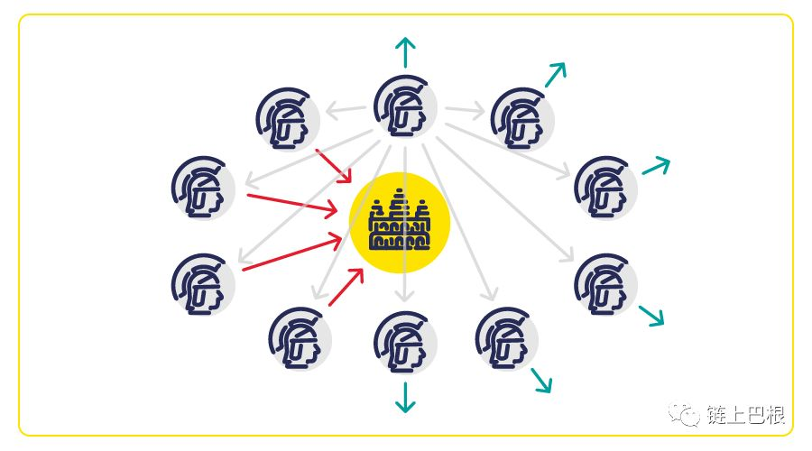
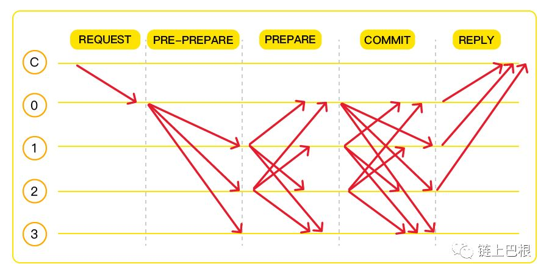
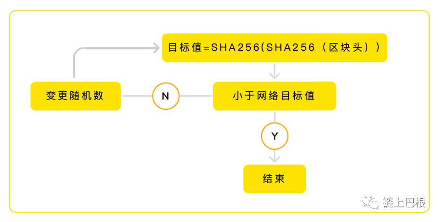

# 生物链林BFChain的共识机制有什么独到之处？

共识（Consensus），即达成一致的意见。自人类协作关系产生起，共识就已诞生。一个正常运转的共识机制，能够帮助一个组织进行高效的协作和分配。

  在以下两种情况下中，是否存在共识？

1.无协作关系，如单打独斗

2.存在中心的环境

第1种情况，由于不存在协作关系，因此无需共识的达成。而第2种情况，系统的共识由中心决定，各参与方只需要服从这个中心即可。如同现实世界中，各种第三方和中心机构的设计，由第三方进行统一的清算和决策。是初期为了提升效率或设立垄断通常所采用的方案。

**区块链的灵魂**

在区块链中，共识机制被视作是区块链的灵魂。之所以是灵魂，是**因为在区块链分布式账本的网络设计下，每个节点拥有同等的权利。** 因此，如何让参与的各个节点达成共识就成为了一个难点。并且还需要假设网络中存在作恶节点时，整个网络通信一致性的问题。

**几种主流共识机制的对比和优劣**

在计算机应用历史上，曾经有许多对于在分布式环境中的一致性问题的尝试。其中，拜占庭将军问题是其中一个最为经典的案例。

▲ 拜占庭将军问题

**拜占庭容错机制**

拜占庭将军问题描述了这样的一种分布式通信环境：拜占庭的将军们围攻一座城堡，军队被分散成很多分支，每一支军队由一名将军独立指挥。将军们之间通过传令兵来保持交流，以期达成一致的行动（进攻或撤退）。但是有些将军是隐藏的叛徒，他们会用虚假的信息来扰乱忠诚将军们的计划。大家并不知道叛徒是谁，那么，忠实将军们有办法达成一致的行动而不被虚假信息干扰吗？

历史上并没有拜占庭军队围攻城堡的事件，这个例子其实是研究分布式一致性（Distributed Consensus ）问题的祖师级人物莱斯利· 兰波特在1982年（Leslie Lamport ）创造的。

根据这一问题，Miguel Castro (卡斯特罗)和Barbara Liskov（利斯科夫）在1999年提出了PBFT（Practical Byzantine Fault Tolerance）实用拜占庭容错算法。

  PBFT算法的运作步骤为：

(1)取一个副本（一个将军）作为主节点，其他的副本（其他将军）作为备份；

(2)用户端向主节点发送使用服务操作的请求；

(3)主节点通过广播将请求发送给其他副本；

(4)所有副本执行请求并将结果发回用户端；

(5) 用户端需要等待F+1个（F为可容忍的拜占庭节点数）不同副本节点发回相同的结果，作为整个操作的最终结果。

▲ 实用拜占庭算法中的三个阶段：

预准备（pre-prepare）、准备(prepare)和确认(commit)

图中C为用户端，0为主节点，1、2、3为副本

因此，拜占庭容错算主要依据法定多数（quorum）的决定，一个节点代表一票，以少数服从多数的方式实现了拜占庭的容错演算。假设总节点数是N，叛徒将军数为F，则当 N >= 3F+1 时，问题才有解，共识才能达成。因此，在拜占庭容错机制中，作恶的节点<=总节点的⅓时系统才能正常运转。

**拜占庭容错机制存在的问题**

1.计算效率依赖于参与协议的节点数量，不适用于节点数量过大的区块链系统，扩展性差。

2.⅓的容错率较低。

3.由于系统节点是固定的，无法应对公有链节点随时加入和退出的开放环境，只适用于联盟链或私有链环境。

**由于PBFT存在的局限性，后来出现了适用于更加开放的公有链环境的共识机制，   在现行的区块链项目及应用中，有以下几种主流的共识机制：** 

**PoW 工作量证明机制** 

关于工作量证明PoW(Proof of Work)，比较浅显的理解方式是结果导向。如任务方交代了某一个任务，无需看见执行的过程，只需要在时间截止时看到执行者完成的任务成果，即可验证其付出了相应的工作量。应用PoW共识机制的典型项目是Bitcoin。

  **工作量证明机制执行的过程：**

▲ PoW工作量证明过程图示

**Hash (block_header) < Target**

target是计算的目标数，通常是一个变量，以控制出块时间平均在十分钟的打块周期。

在这样的设计中，节点拥有的算力所占据全网的比重越大，越有可能在竞争中最快算出这道算数题，获得本轮的记账权并获得区块奖励。

 **PoW的优势与劣势**

▼ 优势

工作量证明机制（PoW ）优点是显而易见的，每个节点可以平等地参与竞争，并通过激励构建了一个正循环的经济系统，从而逐渐积累了保护系统安全的庞大算力。

▼ 劣势

1.算力资源浪费

一个常见的对工作量证明机制的批评是“ 浪费” 能源，因为节点进行算力竞赛是要消耗电力的。

2.权益向顶层集中

此外，由于挖矿利益的驱使，全球许多投资者打造了矿池联盟，以英伟达、比特大陆为代表的矿池巨头成为了事实上维持Bitcoin网络的超级节点。Bitcoin Core 开发团队和超级矿工成为两个主要阵营和利益群体，普通节点也游离在区块链的共识体系之外。

3.51%算力攻击

此外，也有人对在PoW共识机制将带来的网络安全隐患产生担忧。在以算力为唯一衡量要素的前提下，意味着一旦有人掌控了全网一半以上的算力，他将直接控制区块链网络。

**PoS权益证明机制**

为了解决POW所产生的算力浪费问题，产生了许多其它的共识机制。其中POS(Proof of Stake)就是其中一种以权益为基础进行竞争打块的机制。

POS函数运算的过程：

hash(block_header) =<target * coinage

其中，coinage（币龄/也称币天） = 持有的权益数*持有的天数

可以看出，和POW共识机制相比，寻找这个目标数（target）的过程将直接与币天（coinage）相关。coinage这个变量会造成每个矿工看到的目标值不一样。这也体现了POS共识机制的的含义：如果你的币天越大，核心消耗的币天越多 ，也就意味着你越容易获得答案。节点拥有的coinage的情况，就如同企业的股份制中股东按照持有权益的不同比例，获得相对应的利润和分红。

**在这里，我们对币天的计算和在区块产生过程中币天的去向做一个说明：**

举个例子，你拥有200个权益，持有了10天，因此你拥有的币天总量为200*10=2000。

而在区块产生的过程中，每365个币天将额外产生0.05个权益。同时，原有的权益持有时间将被清除。

在这个过程中，假设这个新区块由你产生，那么你新增的权益数量为2000/365=5.479

因此，你持有拥有的权益数量更新为205.479个，但同时持有天数被清除，因此币天为205.479*0=0

 **POS的**优势与劣势****

▼ 优势

PoS通过引入coinage的变量，POS机制避免了计算资源浪费的问题。

▼ 劣势

随着时间的递增，POS权益证明机制也不能够增强区块链网络的安全性。因为这意味着区块链最终也将落到权益最高的少数几个节点手中。

**DPOS 代理权益证明机制**

不论是工作量证明的PoW，还是权益证明的PoS共识中，最终的计算结果都需要通过全网见证，因此，都面临着提高共识的效率的挑战。DPoS（Delegated Proof of Stake 代理权益证明机制）的设计很好地解决了这一个问题。

在DPOS共识机制是基于投票选举的共识算法，有点像民主大会，持币人选出几个代表节点来运营网络，用专业运行的网络服务器来保证区块链网络的安全和性能。

▲ DPOS机制示意图

具体来说，DPOS机制不需要算力解决数学难题，而是由节点投票选出的节点产生区块。每个持币节点将其投票权授予一名代表，获票数最多的前 100 位代表按既定时间表轮流产生区块。所有的代表将收到等同于一个平均水平的区块所含交易费的 1% 作为报酬，如果生产者不称职，就有随时有可能被投票出局。这个设计大大提高了共识效率。

从某种角度来看，DPoS是社区治理加上共识算法，不再是单纯的技术共识，这是与PoW、PoS算法最大的不同。

DPOS的优势与劣势

▼ 优势

1.相对于POW和POS，DPOS机制最大的优点之一是共识达成的周期要短很多。

基于POW的比特币每秒处理7笔交易；基于POW和POS的以太坊每秒处理15笔交易；EOS将通过并行链的方式，预计最高可达到每秒数百万的确认速度。

2.DPOS也会将一部分奖励分给网络维护节点和投票者，作为社区维护的奖励，有利于促进社区积极的运行。

▼ 劣势

但是，这个设计并非完美。也有为人所诟病的”中心化“的特征：11人理事会相当于11个超级节点，拥有较大的见证权利。  

**BFChain独创的DPOP共识机制**

为了BFChain生态更久远的考虑、BFChain数据具有更高的可靠性，有效规避现有共识机制发展过程中出现的问题。受DPOS的启发，**我们重新设计了基于参与度的DPOP(委托参与度权益证明机制)共识机制**，它除了有效继承了POS的业务属性、DPOS的高效属性、PBFT的全员参与属性外，还能有效避免无权益节点和高权益集体作恶成本低的问题。

 **具体来说，DPOP具有以下3点空前创新：**

**1.首次将参与度纳入共识机制中**

BFChain的DPOP共识机制**首次将参与度纳入共识机制中**，并作为其中重要的一个环节。**在BFChain NAAS(节点即服务）的网络设计中，不同节点类型从不同的参与维度获得相对应的参与度证明。**  其中，The R-Node（实时节点）以提供高可靠的网络性能获取参与度，The S-Node（服务节点）通过提供终端服务获取参与度。每一个参与节点在网络上的活动都会一定程度地增加其参与度。参与度的增加以获取到被服务节点的服务签名为依据，“自参与”以提交的有效交易凭证为依据。这样可以保证不同维度的参与者真正参与区块链的网络共识。

**2.多维共识vs单维共识**

在过去的共识设计中，仅仅是以单方面的权益或算力作为评价节点参与共识的因素。**而在DPOP共识机制中，是通过该多维度的综合评判。参与投票的节点不仅要提供权益证明，同时还需要提供参与度证明。**  从而有效避免单一共识机制容易导致的权益集中及集体作恶的问题。

**3.促进生态繁荣共生**

DPOP共识机制的设计使得分布式环境中的不同节点类型既是网络中的参与者、又是生产者，节点参与共识所获得的权益将反向推动节点的参与积极性，从而产生一个良性的生态循环机制。

除此以外，在这样的设计之下，真正实现了通过区块链技术将权益回归个人的用意。可以想见，通过以DPOP共识机制为灵魂的BFChain，将把公平公正的信用时代原型呈现得更加淋漓尽致。
