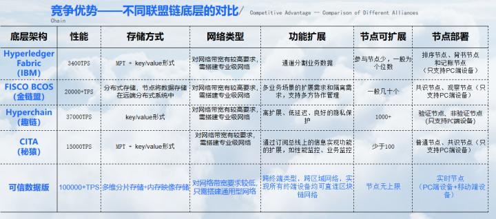

# 生物链林的技术特性和优势

**一、解决企业的最核心问题**

企业家要明白企业的痛点，正常的企业都会有核心的数据或一个核心账本（如传统的ERP），它的痛点就是数据不够安全，存储空间受限，对账及核算效率低等等，当下没有什么有效手段可以解决数据安全问题。 而这正是当下可在不改变其现有硬件的情况下，用生物链林的核心技术解决他们的这些问题，我们给企业提供的就是保证核心数据或账本的安全、高效，让企业的数据安全、存储不受限、记账核算高效、审计透明等，同时不会影响其它功能的正常使用，极其简单，相当于给企业换了一个永动机。 企业一旦进行资产数字化上链，就如同永动机+任意门，核心数据有安全保障，企业运营高效透明，产品销售无处不在，有无限拓展空间，让企业瞬间换赛道腾飞！

例如：企业是汽车，核心账本是发动机，以前发动机需要加油或充电，那现在用了我们技术，企业就变成了永动机；永动机一直在运行，安全有加密技术保障；记账、核账等效率大幅提升；企业产品可以在任意场景，任意平台，任意市场进行流通，销售无处不在；企业相当于拥有了永动机+任意门。

**二、生物链林的特性及优势**

**两大特性及优势：“完全自主化研发的区块链底层基础设施”（永动机） 和 “移动区块链赋能实体企业数字化转型”（任意门）**

1、完全自主化研发的移动端区块链底层基础设施，有96项区块链国家发明专利已过审和62项发明专利已公示（截止2020.12）。

可信数据版是基于移动端公有链开发的平行联盟链底层基础设施，实现高性能、高安全、高可用的分布式网络，让企业的数据安全、存储不受限、记账核算高效、审计透明等，相当于给企业的核心账本换成一个永动机。

相比于其他公司的联盟链技术，本公司的联盟链底层技术有以下的特性和优势：

1）**移动区块链网络**：可信数据版是移动终端可部署为直连节点且参与治理的区块链底层网络技术，满足所有终端设备（包括PC端和移动端）都可以真正上链。 

2）**节点数量无上限**：可信数据版基于DPOP共识机制，采用NAAS技术，参与节点数越多，分布式能力越强，网络性能越高，从而节点数量可以无上限。其他联盟链往往随着参与节点数越多，无法保证参与节点的可信度，性能会快速衰减。

3）**所有参与节点均为全节点：** 可信数据版的所有参与节点不受物理属性分工，不用根据不同硬件属性来区分不同功能的节点类型，都是平等的全节点，都拥有完整的事务处理能力，包括查询、投票、校验、打块/记账等。可信数据版可实现多节点协同快速打块，多节点参与校验，多节点参与同步广播，无法定向攻击，这样极大提升了区块链网络的性能、安全性、可信度。其他联盟链往往根据不同的物理属性来设计不同的节点分工，如设计专门的验证节点和记账节点来处理校验和打块从而提升区块链网络的性能，一旦验证节点和打块节点被定向攻击，整个网络的安全性就会受到威胁。

4）**实现高性能的多节点协同工作**： 区块链网络的性能由硬件属性、网络带宽和系统吞吐量来决定。 可信数据版在不需要设计特殊的硬件属性和网络带宽情况下，在每个节点都参与校验和打块的协同工作的基础上，可以达到10万+的TPS，及能实现毫秒级的交易验证速度。而其他联盟链一般是设计专门的验证节点和记账节点来获得更高的性能，而且其他节点不能参与校验和打块，也无法实现所有节点协同工作；也有的联盟链的TPS只是响应速度而不是包含了校验和打块的性能。

5）**海量数据存储能力和数据服务性能：** 可信数据版通过内存映像型数据库技术+多维分片存储技术，所有节点都可以参与存储并保证一定的数据服务性能，使存储空间和存储性能有质的提升。其他联盟链一般通过提升存储硬件属性来实现存储扩容。

6）**通用型网络部署：** 基于安全高效的分布式网络架构，可信数据版对网络搭建的要求较低，只需要搭建通用型网络即可搭建安全高效的区块链网络。其他联盟链因为要实现更好的网络性能和安全性，一般对带宽有更高的要求，往往需要搭建成本较高的专业级网络。

7）**支持跨平台多终端开发和节点部署**：可信数据版可以在包括移动端的Android、ios，PC端的windows系统，服务器端linux等系统上进行跨终端开发和节点部署，其他区块链只能在PC和服务器端进行开发和节点部署。

8）**支持多链平行和跨链**；可信数据版是基于生物链林底层技术开发的平行联盟链，可与其他平行链进行数据跨链交互，为企业未来无缝迁移到移动公有链奠定基础。

9）**可信数据版属于区块链通用型底层基础设施**：可服务于所有类型的区块链应用服务场景，也可为企业实现私有化的底层区块链部署。目前所有专注于区块链应用服务开发的企业（包括蚂蚁、腾讯、百度等）都是应用区块链平台，他们可以基于可信数据版做区块链应用服务开发。

10）**可信数据版与不同联盟链底层技术对比如下：**

 

2、移动公有链赋能实体企业数字化转型，相当于给企业加一道“任意门”

1）支持实物产品上链（移动公有链BFChain）发行对应的数字资产，让企业能直达终端，数字资产在终端安全、可信、高效地流转，也就是企业的产品可以在任意场景，任意平台，任意市场进行流通，销售无处不在，相当于给企业加一道“任意门”

2）下一步智能合约支持实物资产链上确权并在链上流转，实现企业高度的数字化。
