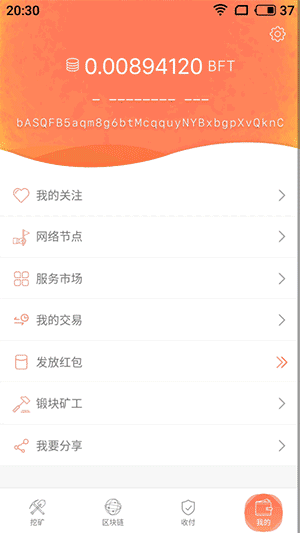
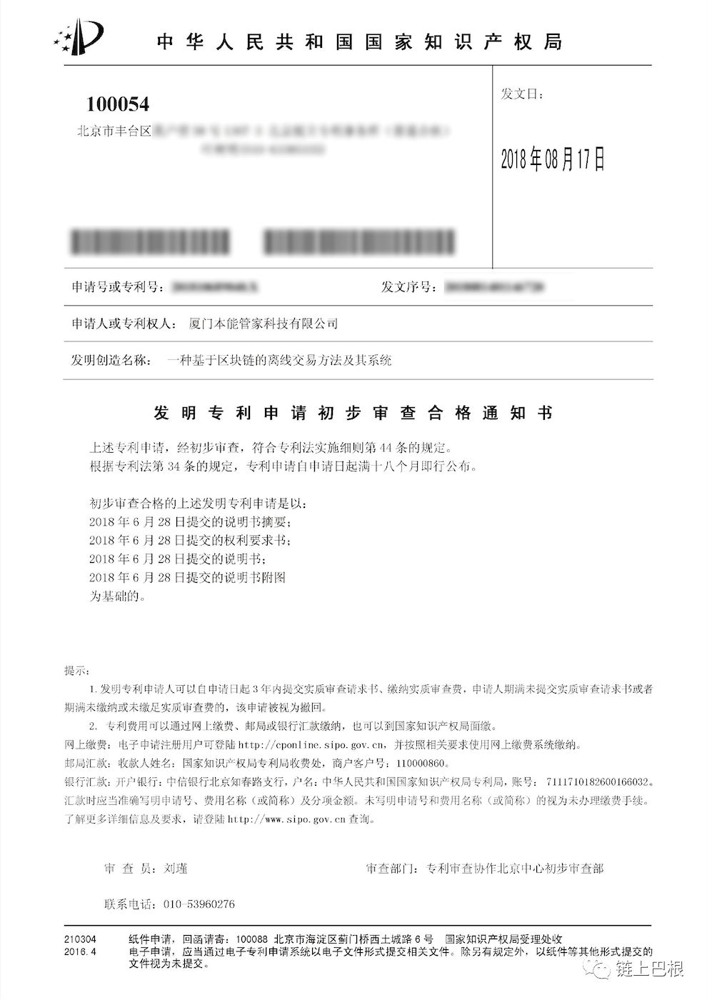
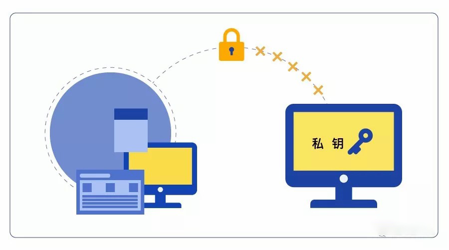

# 分辨真假移动区块链，仅凭这一点就能pass99%的项目

**1  离线情况下如何进行交易？** 

在生活中，我们会碰到这样的场景：当乘坐高铁经过隧道时，移动设备没有信号，但是此时你却急于处理一笔转账交易，怎么办？

**通常的情况是，因为没办法处理交易，只能等到信号恢复再进行处理**。但是，在BFChain的节点软件BFT中，这样的问题可以迎刃而解：**你只需使用其独创的离线交易功能就能获得交易的确认。**

▲BFChain离线交易-转出权益

## 

## **“离线”，到底指的是什么？**

## 在详解这一创新技术之前，我们不妨在不同项目中离线的情况：

我们知道，在PC端节点构成共识的区块链网络上，节点之间的通讯依靠的是网络链接。因此，一个节点“离线”的情况大多数情况是如**断网、关机**等情况。然而，BFChain的情况大不相同。主要的原因是，其拥有自主产权的[全链路双工通信技术](http://mp.weixin.qq.com/s?__biz=MzU3NDc0Nzg4Nw==&mid=2247484456&idx=1&sn=27c7e60a520428e5141813d1966f9f4f&chksm=fd2ce1a8ca5b68be398e27bb6a8fcd79e441cd31b23ad376e85006fd76b23ff1fc39080d3132&scene=21#wechat_redirect)（点击查看往期相关推送）和**应用路由专利**解决了核心的通信和多样化连接方式的难题。

▲BFChain离线交易-接收权益

作为全球首款移动直连的区块链，BFChain赋能接入的节点设备**不局限于互联网的联网情况**，还可通过**蓝牙、NFC、热点等方式进行高速互通，甚至处理离线交易**。BFChain这一离线交易专利技术已于2018年通过国家初审回复。

▲BFChain离线交易专利

2

   **离线交易、离线钱包有什么不同？** 

那么，同样带有“离线”二字，离线交易与离线钱包有什么区别？

两者有一个核心的显著的不同点：**离线钱包只是指个人的账户和密钥信息不联网，因此也叫“冷钱包**”。离线钱包的方式意图通过不接入网络来为用户制造安全感，与此相悖的是，**因为脱离了密码学的保护，并非真正的安全。**

▲离线钱包的核心是不联网

BFChain的离线交易与之完全不同。在**离线交易的模式下，仍然是发送方与接收方之间点对点的交互，不为第三方所掌控，并依托于链上精密的密码学保护，具有极强的安全性。**

3

  **BFChain独创**

**为移动区块链量身打造的离线交易技术** 

**作为全球首款移动区块链，BFChain的每一项技术创新都是在在移动区块链领域的领先实践和创造，离线交易专利技术也是其中的一个体现。**

如文章开头提到的例子一样，移动区块链在实际的应用中面临着这样的考验：

> 如何在不稳定的网络环境下，保证稳定的网络服务？
> 
> 如何在极端的通信条件下提供应对方案？

▲BFChain在离线情况下依然能提供服务

BFChain团队深入移动区块链的业务，并在实际的应用场景为潜在的问题找到了解决方案。 BFChain独创的离线交易专利技术，通过为待处理的交易生成凭证，并通过多样的传输方式使交易获得上链和确认。

4

  **BFChain离线交易功能的意义** 

在解决离线交易需求以外，BFChain离线交易功能有着以下几点重要意义：

###### 

###### **1. 拓展系统交易容量**

BFChain真正去中心化点对点的设计和离线交易能力，让BFChain脱离了时间硬约束，交易容量可以无穷扩增。

###### **2. 突破交易时空限制**

###### 不同于仅支持PC端的区块链项目对实时在线的高度依赖，BFChain独创的离线交易功能让区块链上的各节点之间在交易时，并不完全依赖互联网在线，可以真正做到点对点的交易，甚至实现离线交易。离线交易技术为移动丰富的使用场景提供了灵活的应对方案，突破了时空的限制。

###### **3. 应对极端通讯条件**

离线交易技术可以在应对极端天气和通讯情景下提供稳定的网络服务，**为如非洲等通信情况不理想的地区**，提供交易的解决方案，**让信用时代的基础设施的效能遍布全球。**

▲BFChain可在极端通讯条件下提供离线服务

**4.丰富BFChain生物链林生态**

BFChain作为信用时代的基础设施，离线交易功能的实现具有重要的意义。由于5G技术中多种近距离传输方式的实现，未来将有更多的物联网设备接入BFChain网络中。**BFChain离线交易功能为多种终端设备突破时空的限制并参与共识建立了坚实的基础。**

#### **5.分辨真假移动区块链**

离线交易功能也是其中一个重要的判断依据。基于移动设备的使用场景，移动设备具有支持NFC、蓝牙、热点等多种方式的物理特性，**而支持丰富的通讯手段也证明了BFChain是真正支持移动端设备的区块链。**
