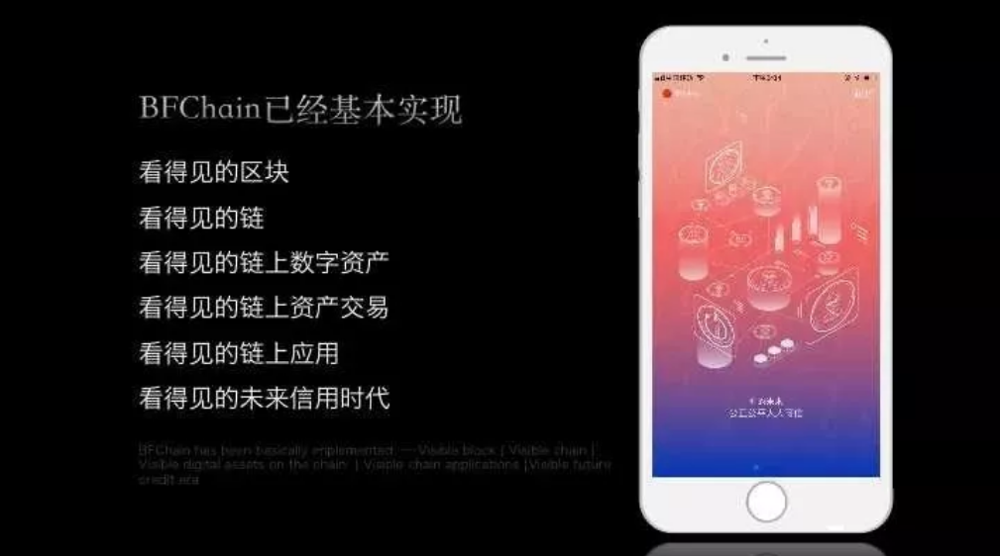

# 生物链林BFChain与其他公链或手机挖矿产品的区别

**BFChain全球首款移动端公链跟其他公链或其他所谓手机挖矿的产品有什么不同？**  

**当下区块链项目**

当前落地的区块链，几乎都只能在PC端或服务端运行，虽然有些有轻钱包，一定程度的解决了移动端数据查询及交易签名的问题，但是移动端并不能参与到区块链的共识机制中，不能参与共识机制将不拥有区块链的治理权。

以太坊等公链开发移动端DAPP只是使用智能合约让移动应用token化，移动端不能参与区块链治理，需要引入中心化节点用于提供区块链到移动端之间的数据中转服务，本质上引入了第三方中心信用.

**这种DAPP上所谓的手机挖矿也只是中心化的权益奖励而已**，更通俗的说，这种手机挖矿只是中心化的服务器转给移动端的，移动端用户并没有在链上，更不能参与链上治理。

**BFchain**

**BFChain真正在技术方面支持并实现了移动端用户上链并参与链上治理**，其首创的符合移动端特性的DPOP共识机制，让人人参与链上治理的同时通过多样化的参与度贡献方式获得权益奖励，实现并重塑移动端信用机制。

同时，BFChain与日常应用场景结合起来，如社交场景下聊天即挖矿，通过区块链解决了中心化APP的无隐私、不安全、无信用等问题，也能让用户在使用DAPP的同时也是在参与区块链治理从而获得权益奖励。

**如上所述基本上目前所有的所谓手机挖矿的产品都是中心化权益奖励，没有去中心化的信用机制，不是真正的移动端区块链。**
