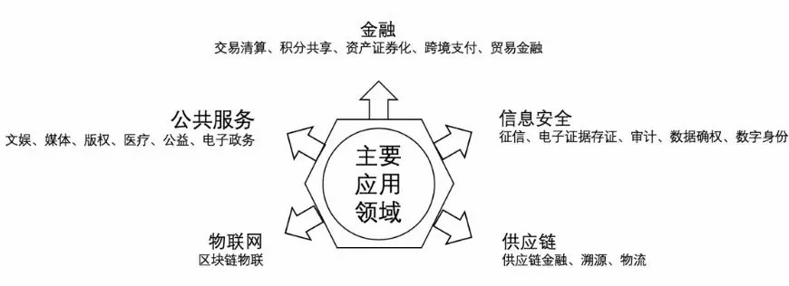
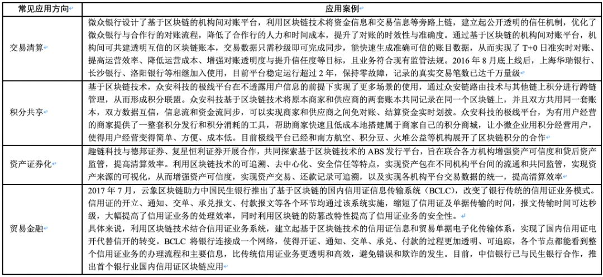
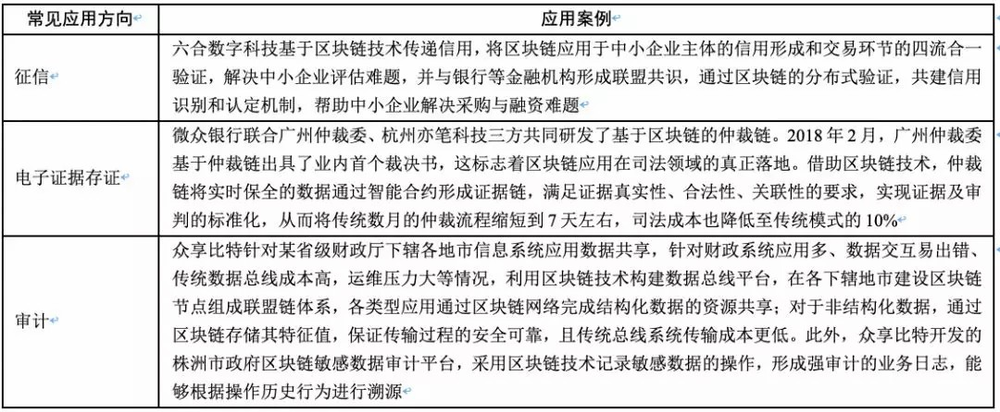

# 3个维度, 3种误解, 20大应用场景, 这才是真实的区块链!

”区块链+“是相对于”互联网+“而言的，就是“区块链+各个传统行业”，但这并不是简单的两者相加，而是利用区块链技术或特性，让区块链与传统行业深度融合。  

区块链起源于技术创新，但更重要的是，技术创新带来的模式创新和思维创新。回顾一下互联网+的历程，初始只是将传统企业互联网化、移动化，发展到现在，许多传统企业已经运用“互联网思维”创造了新的商业模式。**大体上，拥抱区块链可以分为三个维度：区块链技术、区块链模式**和**区块链思维。**

- 区块链技术：关于区块链技术前面章节已经介绍得很详细了，概括来说，它包括分布式数据存储、点对点传输、共识机制、加密算法。传统公司与区块链技术的结合就是将业务整体或部分上链，应用于“链”上。这个“链”包括公链、联盟链、私链及侧链。

- 区块链模式：区块链模式可以定义为结合通证（Token）生态系统的生产关系的变革。区块链模式的核心是通证生态系统，通证生态系统的核心是激励机制。传统公司结合区块链模式本质上是研究利用通证构建完善的激励机制。目前行业内提出的“币改”“链改”“票改”等，都是在此范围内的创新。

- 区块链思维区块链思维很难下定义，高高在上的“互联网思维”已经将一切好听的商业思维都囊括进去了。不过与互联网思维一样，区块链思维也是从传统的商业社会中延伸出来的。互联网侧重于信息（数据），区块链侧重于价值（通证）。**正是因为区块链的价值属性，它实现了原有互联网和商业不够重视、不愿意或者无法落地的需求，进而形成了它的一套商业逻辑，可称之为区块链思维。**

根据区块链技术和区块链模式来分析，**区块链思维包含以下三大要素**：

**a) 去中心化**

中心化与去中心化之争从人类群居生活诞生之初便已存在。人类的天性是喜欢群居而又渴望自由。在刀耕火种的年代，人们恐惧于自然之力与生存压力，更愿意放弃自由而依附于族群、村落和国家。**当满足基本物质需求后，人类又开始为了追逐自由而挑战曾经归属的中心化组织。**区块链就是在技术的驱动下，按照去中心化思想，追求技术所能触及的“自由”。

现今的社会结构严格地讲不能算是中心化，很多制度的诞生和改进都存在着更多的博弈因素。但并不是所有领域都存在自由竞争，尤其在能源、地产、金融等领域，由于依赖性极强，自由竞争多数走向垄断或寡头垄断。**比特币正是对金融的寡头垄断发起的去中心化挑战。**

所以，通过区块链技术实现去中心化，并非与现有的社会结构相对抗，而是一种平衡和优化。去中心化不是消除中心，是对正态分布、幂律分布结构优化而成的分布式，是对权、责、利进行的分布式改造。

**b) 代码即法律**

人类社会在建立信用关系时发明了契约。现在契约精神已经成为文明社会的灵魂，但是违约现象仍然屡见不鲜，**小到被人“放鸽子”，大到一个企业的信用破产、债务违约，违约现象似乎成为另一种常态**。为了降低违约率，强化信用风险管理，契约的发展经历了口头协议、书面合同和电子合同三个阶段。区块链上的契约便是电子合同的升级版本。

在比特币中，通过在区块链上透明的公共账本中进行交易记账来保证交易的真实性与不可篡改性，从而建立信任的基础，降低信任的成本。但从去中心化思维可以推论，人类的任何行为都可以参考交易记账记录在分布式账本中，实现去中心化。

而以太坊认为，**人类的行为极其复杂，不能单纯地按照交易记账的方式来处理，而应该应用协议来完成，在区块链上通过代码来执行协议**，由此诞生了智能合约：“一套以数字形式定义的承诺，包括合约参与方可在其上面执行这些承诺的协议”。

所以，**代码即法律，可以理解为协议代码化，即通过代码撰写不可篡改（或需要达成一定的共识才能篡改）的契约，在公开透明的链上自然履行契约**。协议代码化在现实经济活动中非常实用，尤其在金融领域、供应链领域，通过协议代码化，可以增加合作透明度，提高合作效率，降低信用风险，提升履约率。

**3) 共识意识**

区块链作为去中心化网络，每个参与方都是平等的、自由的、公平的。如果没有共识，整个区块链也将不复存在。但这里的共识并不仅仅是指分布式系统中的共识算法，更是指合作共赢意识。

**在区块链世界中，通过通证将创始团队和参与方绑定到一条船上，只有合作共赢才会使己方获取更大的利益。**   这种激励机制使得参与方能够发挥主观能动性，积极地投身于区块链项目的运营、监管活动当中。我们可以看到很多区块链项目有大量的自组织社群、社区，他们会积极地帮助项目进行推广营销活动。这就是共识的一种体现。

**2、关于“区块链+”的一些悖论与误解**

现在很多领域已经开始尝试做区块链项目，有很多人感受到了这项技术带来的便利性，但同时又有很多人试图把区块链当成一根救命稻草，过度神话区块链，以为应用了区块链技术就能治好企业所有的“病”。这里需要对人们关于企业应用区块链的一些误解做一下解释。

**a) 很多人认为，区块链就是发币圈钱？**

2017年是区块链非常火的一年，很多人关注到区块链并不是因为关注它的核心价值，也不是因为关注它的分布式存储，而是因为觉得区块链可以发币，可以融资！于是很多处在生存边缘的企业，都想要依靠发币融资来解决企业的生存问题。但这真的有效吗？

当然不是！很多人说，在区块链行业发币融资非常容易，其实不是这样。**发币融资的火爆，不是区块链本身带来的，而是这个行业的风口带来的，是这个行业的热度带来的。**

但是这个行业的热度不会永远持续下去，融资或者项目的进展也不会一直如此容易。从2017年10月份的一个数据就能看出来，一旦区块链的热度有所下降，当月的区块链项目就有一半以上未达到融资期望额度。所以，**和所有其他行业的商业模式及业务模型一样，区块链也是要服务于实体经济的**，虚无的区块链最后会灭亡。

**b) “区块链+”就等于提前上市吗？**

要解答这个问题，首先需要了解两个概念，即通证和股权。

- **股权是中心化组织的经济行为的产物，股份的大小是差异化的，有话语权、控制权及利益分配的差异**；而**通证是区块链经济下的产物，相对而言实现了去中心化**。另外，通证拥有数量的多少，并不意味着话语权的大小，以及对项目控制权的多少。

- 股权的主体是公司、有限公司、营利机构；而区块链的通证主体有可能是上述机构，也可以是社区、社群、甚至是基金会，而不一定是股份制公司。

**既然通证不是股权，为什么需要有一个价格呢？** 其实这就和萝卜青菜、石油煤炭需要价格是一样的。因为通证价值在某个领域中会被使用到，所以它需要一个公允的价格。**在市场经济体制下价格是由市场机制来制定的，在区块链的领域中，价格是通过人与人之间的供需关系来决定的**。比如以太坊，建立智能合约需要消耗 Gas，所以就需要有一个价格来衡量该消耗。

所以，不能认为“区块链+”就是企业发展的捷径，做企业和行业的长期价值的建设者，才是企业发展的唯一出路。

**c) 是不是区块链发了币就一定会涨？**

**从微观经济学的角度来说，任何事物的价格都是由它的供给和需求两个方向的力量综合平衡而决定的**：当供大于求的时候，币价下跌；当供不应求的时候，币价上涨。举例来说，区块链项目融资很多时候会使用以太坊，所以以太坊的价格在区块链融资特别火爆的时候就会上涨，在区块链融资特别冷清的时候就会下跌，这是一个典型的由供需关系决定价格的例子。

币价不是凭空就会上涨的，从本质上说，区块链世界里的商业的客观规律，是和传统资本市场一样的，**只有真正地为社会提供价值，才能获得社会的认可，才会被广大使用者所接受，这种项目的通证价值才会变得更高**，只有贡献了积极价值的项目，其通证价格才会有所体现。

由于区块链行业发展过于快速，导致大家还来不及理解它的时候，已经有很多人在打着区块链的旗号做各种各样的事情了。很多项目，或者某些人，在区块链领域里做了一些不好的事情，不管从长期来说，还是从短期来看，都会透支社会公众对区块链的信任。

区块链技术现在的发展还处于一个非常早期的阶段，**如果社会对这项技术失去了信任，无疑会减缓一个具有革命意义的技术进程，文明革新的进程也就被延迟了。**

**"区块链+"的探索与尝试** 

区块链技术的主要应用领域涉及**金融、信息安全、供应链、物联网和公共服务**五大方向，可以落实到数十个应用场景，如下图。  

*“区块链+”的五大主要应用领域*

**1、金融领域**

区块链能够提供信任机制，具备改变金融基础架构的潜力，各类金融资产如股权、债券、票据、仓单、基金份额等都可以被整合到区块链技术体系中，成为链上的数字资产，在区块链上进行存储、转移和交易。

**区块链技术的去中心化，能够降低交易成本，使金融交易更加便捷、直观和安全。**  区块链技术与金融业相结合，必然会创造出越来越多的业务模式、服务场景、业务流程和金融产品，从而给金融市场、金融机构、金融服务及金融业态发展带来更多影响。

随着区块链技术的改进及区块链技术与其他金融科技的结合，区块链技术将逐步适应大规模金融场景的应用。下表是金融领域的应用案例。

**2、公共服务领域**

传统的公共服务依赖于有限的数据维度，获得的信息可能不够全面且有一定的滞后性。**区块链不可篡改的特性使链上的数字化证明可信度极高，在产权、公证及公益等领域都可以以此建立全新的认证机制，改善公共服务领域的管理水平。**

公益流程中的相关信息如捐赠项目、募集明细、资金流向、受助人反馈等，均可存放于区块链上，在满足项目参与者隐私保护及其他相关法律法规要求的前提下，有条件地进行公开公示，方便公众和社会监督。下表是对典型公共服务领域场景应用的梳理。

**3、信息安全领域**  

**利用区块链可追溯、不可篡改的特性，可以确保数据来源的真实性，同时保证数据的不可伪造性，区块链技术将从根本上改变信息传播路径的安全问题。** 下表是对信息安全领域场景应用的梳理。

**4、物联网领域**

区块链+物联网，可以让物联网上的每个设备独立运行，整个网络产生的信息可以通过区块链的智能合约进行保障。

**a) 安全性**

传统物联网设备极易遭受攻击，数据易受损失且维护费用高昂。物联网设备典型的信息安全风险问题包括，固件版本过低、缺少安全补丁、存在权限漏洞、设备网络端口过多、未加密的信息传输等。**区块链的全网节点验证的共识机制、不对称加密技术及数据分布式存储将大幅降低黑客攻击的风险。**

**b) 可信性**

传统物联网由中心化的云服务器进行管控，因设备的安全性和中心化服务器的不透明性，用户的隐私数据难以得到有效保障。而区块链是一个分布式账簿，各区块既相互联系又有各自独立的工作能力，保证链上信息不会被随意篡改。因此**分布式账本可以为物联网提供信任、所有权记录、透明性和通信支持**。

**c) 效益性**

受限于云服务和维护成本，物联网难以实现大规模商用。传统物联网实现物物通信是经由中心化的云服务器。该模式的弊端是，随着接入设备的增多，服务器面临的负载也更多，需要企业投入大量资金来维持物联网体系的正常运转。

而**区块链技术可以直接实现点对点交易，省略了中间其他中介机构或人员的劳务支出，可以有效减少第三方服务所产生的费用，实现效益最大化。**

**5、供应链领域**

供应链由众多参与主体构成，存在大量交互协作，信息被离散地保存在各自的系统中，缺乏透明度。**信息的不流畅导致各参与主体难以准确地了解相关事项的实时状况及存在问题，影响供应链的协同效率。** 当各主体间出现纠纷时，举证和追责耗时费力。

区块链可以使数据在各主体之间公开透明，从而在整个供应链条上形成完整、流畅、不可篡改的信息流。这可以确保各主体及时发现供应链系统运行过程中产生的问题，并有针对性地找到解决方案，进而提升供应链管理的整体效率。下表是供应链领域的场景应用。

