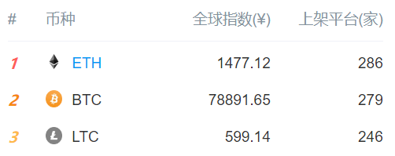

# 比特币不是区块链的全部，创新才是未来

一直以来，外界很多人把区块链和[比特币](http://mp.weixin.qq.com/s?__biz=MzUyNzE4MDM2MA==&mid=2247490637&idx=2&sn=eff877ee6f82f85a00b0c68201f9f49d&chksm=fa022b6acd75a27c62f0fb4792eea5f44efbbf529eb19282c6874fa1f34404b8dd8b9dbd53b6&scene=21#wechat_redirect)混为一谈，认为比特币就是区块链，还形成了一股不小的“共识”。其实，许多人只知道比特币，鲜有听说其它加密货币的存在，一旦听到别人说着陌生的名称，第一个意识自然就是认为这是个“山寨”吧。

然而，随着时间的推移，越来越多的竞争者进入人们的视线里，会不会有一天，突然一个“潘多拉魔盒”被打开，纠正并打破这种“共识”呢？

 01比特币自身的束缚 

 比特币这个支付系统的天才设计带来了许多前所未有的优秀特性，这是公认的。

然而，在10年前非常有限的互联网基础设施条件下，精巧的设计为了保障系统足够安全和去中心化，做出了诸多的限制，导致它的拓展性也几乎被锁死。也就是说，**比特币系统的设计其实是受到了当时基础设施和技术条件的相互制约。**

举个例子：

> 人类刚刚发明汽车时，马路很窄，并且汽车在车轮、车身、发动机动力来源的设计上以及当时的技术条件都大大限制了它的速度。于是，1886 年第一辆汽车的时速只有 15 公里。然而到了现代，技术条件没有问题了，马路很宽，基建也很发达，很多国家的高速公路上甚至不再限速，而且人们的需求越来越多样化，各种各样用途的汽车开始服务人类。

在区块链这种底层技术被挖掘出来发光发热的技术革命背景下，人们期待着区块链技术能够满足在各种领域的迫切需求。尽管有人认为比特币只需要当好它的数字黄金就够了，但事实证明，整个比特币社区也好，分叉出去的社区也好，他们都在担心比特币未来的“前途”，这已经是不争的事实。**比特币社区最担心的事情，莫过于比特币在整个加密货币市值占比的缩水。**

其实，比特币社区早就开始意识到 10 年前的技术方案在当前不管是性能还是拓展性方面都是不够用的，若再不谋求改变，它的领先优势逐渐会被后来者取代。**正是因为社区的焦虑，才有了有限扩容、提升扩展性为闪电网络铺路的隔离见证，以及支持大区块扩容的 BCH 分叉。**

比特币的第二层，除了[闪电网络](http://mp.weixin.qq.com/s?__biz=MzUyNzE4MDM2MA==&mid=2247493877&idx=2&sn=90e37759486f79e53422649405131cb8&chksm=fa01dfd2cd7656c4f1d147299625d94090167600bbe8d6a0cf56efa9a283ee867c61218dc3c4&scene=21#wechat_redirect)外，有 2 个较为知名的侧链，其中有一个是 RSK，愿景是要做一个跑在比特币网络上的智能合约平台以满足更多人的需求，当年亦曾经被称为“天王级”的项目。

尽管 RSK 大致完成了白皮书上的技术实现，然而它的开发已经超过 3 年，进度相当缓慢，我们看到的是开发者们似乎并不买账，目前使用 RSK 网络的人也很少，因为它才刚刚开发完，以太坊那头早就在开始准备切换到 2.0 的 PoS 事宜了。以太坊用亲身经历去证明了[PoW 共识机制](http://mp.weixin.qq.com/s?__biz=MzUyNzE4MDM2MA==&mid=2247491618&idx=2&sn=e89a3f619530703aa321701fdf9a3a0d&chksm=fa01d705cd765e139a97f8e34743f8b136a3ad5897e41a2401181b1621eea518f30e72de27ce&scene=21#wechat_redirect)上直接跑[智能合约](http://mp.weixin.qq.com/s?__biz=MzUyNzE4MDM2MA==&mid=2247492547&idx=2&sn=4bf672ff2ffac28b9a1b82548d6cc6e7&chksm=fa01d4e4cd765df2b365ff5b482ce4ba1bac7847afeb90303dd3eb1d5a2c6eba7ac9403dec00&scene=21#wechat_redirect)平台是错误的。

耗时 3 年好不容易做出来却依然不能解决什么问题，于是 RSK 只好成立了 RIF 实验室，又在比特币第二层 RSK 的基础上做了一个第三层 RIF OS 提高性能，而这一层又得忙活多久？不得而知。

从 RSK 数年来的经历上，我们可以发现，**比特币作为数字黄金是成功的，但因为拓展性的限制，要做智能合约以满足更多的需求还是相当困难的。** 或许10年前，中本聪从未想过比特币未来要做这么多事。

综上，比特币自身的诸多限制并不能满足所有人的需求，即便可以，也需要在第二层、第三层来实现，这明显是非常困难的，对强共识支持的原系统进行大刀阔斧的升级可能性非常小。

一些开发之初就把拓展性设计到底层的项目，比如 ETH2.0、[专门为拓展第二层进行过特别优化的 Nervos 项目，](http://mp.weixin.qq.com/s?__biz=MzUyNzE4MDM2MA==&mid=2247497622&idx=1&sn=da59c70bae2a3b6cf3a055d53e844a8d&chksm=fa01c0b1cd7649a7d858507e23d7b8f470f5e08cf69a37005e559da1efacc121842ea411de3b&scene=21#wechat_redirect)破除了各种技术限制使得项目更容易实现，开发周期也相对会更短，若再能获得不少人的共识，那么成功率也不会低。

 02 变幻莫测的未来

先讲一个故事：

> 就在国内互联网刚兴起的时候，有一个搜索引擎公司杀出重围，凭借着互联网流量入口占领了互联网领域大片江山，“百度一下，你就知道”，成为数亿网民多年来口口相传的共识。彼时的百度可谓风光无限，在流量为王的互联网时代中，排在 BATJ 第一位。多年来，不论有多少新老搜索引擎的竞争，至今它仍然占领着搜索引擎市场份额的 70% 以上。
> 
> 然而，自从移动互联网时代的爆发，流量入口变得多样化后，微博、微信、今日头条的崛起瓜分了越来越多的蛋糕，让百度压力倍增。一个时代悄悄地落幕，某些曾经立于不败之地的巨头若没有抓住新的契机也得跟着掉队。8 月 14 日，曾经的小公司网易市值超过百度，成为中国互联网公司第五名。

区块链行业依然处于野蛮发展的早期，它距离终点还很远，所有项目都还在赛道上奔跑，也不断有新的“运动员”加入进来。**在未来，物联网、AI、5G 等革新技术正在马不停蹄地到来，未来的商业、生活场景必然与现在不同。**

即便比特币像上面故事中的巨头一样，在很长一段时间内占据了很大的市场份额，但仍然面临着未来高新科技飞速发展带来的各种创新技术的竞争。

未来的事情，没有人能够预测。因此，即便有人说“除了比特币，所有的山寨币最终都会死去”，也只是猜测而已。**在变幻莫测的未来面前，没有什么是不可能的。** 

 03  后生可畏

只有比特币，没有主流币？其实，下面这 2 张图就能否决。

▲ 上架的平台数排行榜，数据来自：非小号

▲ 数据来自：bitinfocharts

**在加密市场上，基本上有比特币的交易平台，就一定有[以太坊](http://mp.weixin.qq.com/s?__biz=MzUyNzE4MDM2MA==&mid=2247491408&idx=2&sn=cc7ae4ba4368edf6c605117963c37e5e&chksm=fa022877cd75a161a34f0b5da2a7ff1158cdf1cd22742588da934ba69fa689f770f556b9c299&scene=21#wechat_redirect)，没有比特币的平台也可能有以太坊。** 2017 年以来，以太坊活跃地址快速接近比特币，并且曾经超越过。这个年仅 3 岁多的以太坊，在 10 岁多的比特币面前许多方面尽管看似并不够强势，但市场告诉我们，其流行程度已经开始比肩比特币，甚至要超越比特币。

在 2017 年，如果有人说以太坊未来市值会超越比特币，也许大部分人都会相信，现在恰恰可能会相反。其实这些态度，终究只是顺应着市场行情而走，当以太坊再次崛起时又会有同样的声音出来。 

不论是挖掘出区块链更多价值的智能合约平台开创者以太坊，还是让众多金融机构开始感受到威胁的瑞波，正是它们的出现，让人们看到区块链的未来除了数字黄金之外的更多可能性。**不论这些后来者最后成败与否，后续必然会有更多的竞争者出现。**

 **04**   创新路上的竞争币

我们知道，即便参天大树能够疯狂地霸占和吸收水土中的养分，在参天大树边上依然能够生长出许多花草。全球数十亿人在一个自由市场中，亦不会只有一个共识。目前有许多问题比特币是无法解决的，区块链未来的空间也还非常大。比特币大船难掉头，我们可以看到近年来的创新者们就沿着解决问题的方向和未来的空间在前进。

扫一眼当前的竞争币们，它们的方向各异，针对比特币的不足提出的各种解决方案几乎无孔不入：**大区块扩容、链下扩容、[跨链](http://mp.weixin.qq.com/s?__biz=MzUyNzE4MDM2MA==&mid=2247495528&idx=1&sn=b0508894fef3a8a4e48f7e1501eacd8a&chksm=fa01d84fcd765159bef1f4bd9d50a18e75569ac14f065ed9bd602ea067a38509ade42f6d9629&scene=21#wechat_redirect)、分层、[分片](https://mp.weixin.qq.com/s?__biz=MzUyNzE4MDM2MA==&mid=2247496353&idx=2&sn=1bb7330bcba48078f70f2b970b1f4e30&chksm=fa01c586cd764c90ce1186d86c65625d253046056efc704094044018e224792d13eea58d8862&scene=21&rd2werd=1#wechat_redirect)、DAG、混合共识、[隐私保护](http://mp.weixin.qq.com/s?__biz=MzUyNzE4MDM2MA==&mid=2247493832&idx=2&sn=6f727663c4a638986a038cf8d51e6e3e&chksm=fa01dfefcd7656f931eb2239bedd45208a61891301824f86950eba090d4ad56cf75065aceccc&scene=21#wechat_redirect)、多中心化、垂直应用** 等等，几乎只要能想到的方向，都有项目在做，而这些方向也逐渐从提出到落地。

不少项目带来的创新已经获得了人们的认可，这些竞争币们的社区也在不断地发展壮大，谁能一句话就把它们对区块链行业立下的汗马功劳抹去？

▲ 2018年比特币市值占比低至33%

之所以许多人认为除了比特币其它的都不行，主要是因为比特币近期的强势和“山寨”自身的问题。**如果把竞争币当做一锅粥，那么这可能不是因为一颗老鼠屎坏掉的粥，而是整锅粥可能只有一半不到的米，剩下大半都是老鼠屎**。

所以，这也没法责怪群众眼睛不雪亮，而是当下行业监管未规范到位，同时缺乏一些标准，让老鼠屎混进来太多。若监管落地推动行业进入正轨，老鼠屎得以淘汰和肃清，创新的竞争者们就可谓是守得云开见月明了。

 **05** 创新才是未来

**时代在变、风向在变，科技更以惊人的速度在变，没有任何一个巨无霸能够永远长存。**

敬畏未来、敬畏后生。区块链发展初期的上半场，野蛮的生长也带来了更多的共识；未来的区块链，将会是一个充满竞争的平台，而那些抓住科技变化契机的创新者将引领未来。

来源| 白话区块链
