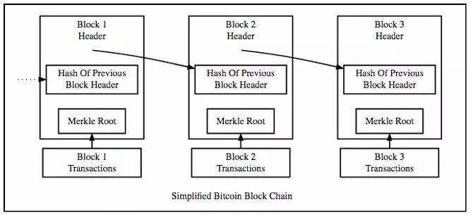
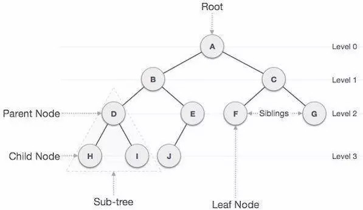
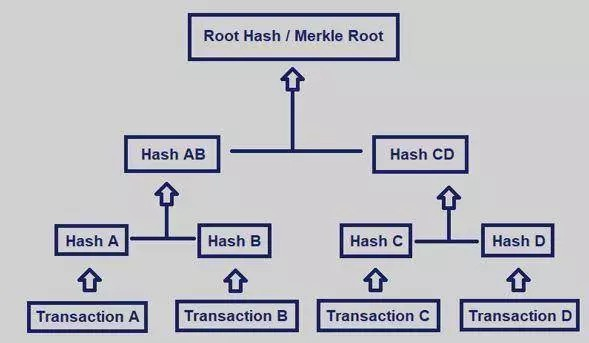
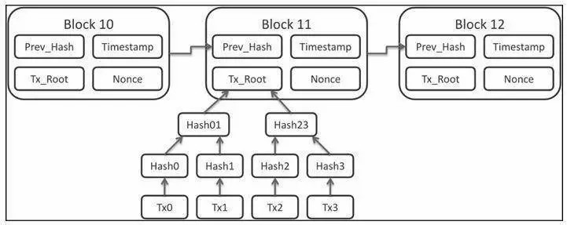

# 学习| 为什么密码学是区块链的核心

大家都知道，区块链是比特币的底层技术，但区块链技术的核心，又是什么？

**是密码学。**

**密码学是区块链技术的核心。**

所有的交易信息都会被编码到区块里，而区块链则是由这一个个区块连接在一起而形成的结构。

密码技术由来已久，主要经历了古典密码、机械密码、现代密码三个发展阶段。随着历史推进，密码技术不断在演变，密码学成为了科学。而今天我们就要一起来看看，**区块链技术当中的密码学，与过去我们了解的密码学有什么不同？它的作用在哪里？**

**什么是密码学？**  

密码学是开发防止第三方查看私人数据的学科。现代密码学结合了数学、计算机科学、物理、工程等学科。一些重要术语的定义如下：

- **加密**将文本编码成不可读的格式。

- **解密**将混乱的信息转换为其原始形式。

- **Cipher密码** 一种用于执行加密或解密的算法，通常是一组可履行的、定义明确的步骤。

【密码学】在以前是加密的同义词，即把信息从可读的格式转换为毫无意义的信息的过程。加密技术的历史可以追溯到古埃及，历史十分悠久。

举例来说，Caesar Cipher凯撒密码是凯撒大帝用来与将军们进行安全通信的一个著名的密码。密码将信息中的每个字母都移动了一定的距离（移位为2），A变成了C，B变成了D，依此类推。

*（http://practicalcryptography.com/ciphers/caesar-cipher/）*

区块链技术以多种不同的方式对钱包、交易、安全性和隐私保护协议进行加密。本文将讨论与区块链技术相关的一些重要加密主题，包括**公钥加密**、**Hash散列**和**Merkel树**。

## 

**公钥加密**

**公钥加密（也被称为非对称加密）是一种使用一对密钥（公钥和私钥）进行加密的密码系统。** 公钥可以广泛分发，但是私钥只有其所有者才知道。密钥总是成对创建的，每个公钥必须有一个相对应的私钥。

**公钥加密经常被用于以安全的方式加密两个人或两台计算机之间的消息。** 任何人都可以使用某人的公钥来加密信息，但是信息一旦被加密，只有使用相对应的私钥才能解密该消息。

**假设Alice想要向Bob发送一条加密消息，其工作原理是这样的：**

- Alice使用Bob的公钥来加密消息；

- Alice将加密后的消息发送给Bob，如果被第三方拦截，那么第三方只能看到随机的数字和字母；

- Bob使用他的私钥来解密和读取收到的消息；

这个过程可以用下面这个图表来表示：

       

*来源： Wellesley College*

**公钥加密是区块链技术的一个基本组成要素，是钱包和交易的基础技术。** 当用户在区块链上创建钱包时，就是在生成公私密钥对。

钱包的地址，或者其在区块链上的表示方式，是由公钥生成的一串数字和字母的组合。**由于区块链技术本身的性质，这个地址对所有人来说都是公开的，可以用来检查钱包里的余额或向其发送代币。** 

与钱包相关联的私钥证明了钱包的所有权和控制权。这是唯一能把代币发送出去的方法，如果私钥丢失，那么里面的代币将被永远封存。

区块链上的交易不过就是一条广播信息，其本质是在说，“从我的钱包里取出X枚代币，并将X枚代币存入另一个钱包”。**一经确认，交易就会被不可更改地写入分类账簿，并更新双方余额。**

然而，此交易消息需要发送钱包的密钥签名才有效，消息广播后，任何人都可以使用钱包的公钥来确保来自私钥的数字签名是真实的。这是区块验证者们在向区块链添加交易（即消息）前要承担的一个角色。

## 

**加密Hash散列**

加密Hash散列是区块链技术的另一个基本要素，它直接保障了区块链的不可变性，这是区块链最重要的特性之一。

Hash是计算机科学中的一个术语，意思是输入任意长度的字符串，然后产生一个固定长度的输出。**无论某个Hash散列函数的输入是3个字符还是10个字符，其输出的长度始终是相同的。**

**加密Hash散列函数具有以下几个关键特性：**

- **确定性：** 无论给函数多少次特定的输入，它都始终会得到相同的输出；

- **不可逆性：** 无法根据函数的输出来确定输入的内容；

- **抗冲击性：** 没有任何两个输入可以得到相同的输出；

加密Hash散列函数的另一个重要特性是改变输入中的任何一位数据都将极大地改变输出结果。举例来说，111111和111112的Hash散列输出将会是绝对唯一的，且彼此间没有任何联系。

**加密Hash散列函数最为广泛的用例是密码储存。** 大多数网站不会储存用户的原始密码，它们会储存用户密码的Hash散列，并在用户访问给定的站点并输入密码时，检查散列是否匹配。**如果黑客入侵了他们的数据库，也只能访问不可逆的密码Hash散列。**

那么，加密Hash散列又是如何实现区块链技术不变性的呢？答案就是每个新的数据块都包含前一个区块中所有数据的Hash散列输出。

**想象一个刚刚添加了第1000个区块的区块链。** 来自区块999的数据作为Hash散列函数输出存在于第1000个区块中。然而，包含在区块999中的数据是区块998中数据的Hash散列，区块998中又包含了区块997中数据的Hash散列。

**这样向前回溯，从第1000个区块到第1个区块就这样通过加密Hash散列连在了一起。其结构图如下所示：**

 

一直以来，这就是保证区块链中数据具有不可变性的原因。如果有人想在前面的区块中哪怕更改一位数据，那么不仅会改变该区块数据的Hash散列输出，还会改变后面的每一个区块。网络上的矿工和节点会立刻注意到所产生的Hash散列与其链的版本不匹配，并拒绝此次更改。

供参考：比特币使用的是名为SHA-256的加密Hash 散列函数，Ethereum使用的是名为 keccak256的加密Hash 散列函数。

## 

**Merkle 树**

上面的图是区块链的一种简化版本，它省略了一些重要信息。图中有三个向上的箭头，表示每个区块的交易都被储存在一个Merkle根中，而这就是Merkle树的根节点。

树是计算机科学中的一个术语，代表以分层树状结构储存数据，**其中，数据位被称为节点。** 有一个根（顶）节点，下面连接着“子”节点（Child Node），子节点本身也有子节点，依此类推。下图展示了一个典型的树型数据结构：

      

如图所示，树中的节点组被称为子树（Sub-tree），没有子树的节点（其下没有数据的节点）被称为**叶子节点**（Leaf Node）。

Merkle树（或称为Hash散列树）是一种使用加密Hash 散列函数来储存散列输出（而不是每个节点中的原始数据）的树。**每个叶子节点由其原始数据的加密Hash散列组成，而每个父节点（Parent Node）是其子节点Hash散列组合的Hash散列。**

Merkle根仅仅是Merkle树的根（顶）节点，Merkle根表示其左右子树组合的Hash散列输出。下图是一棵有着4个叶子节点的Merkle树。

       

每个叶节点表示交易A、B、C和D的数据的Hash散列，然后将Hash A 和Hash B组合并求散列以生成Hash( A,B)，并且以相同的方式生成Hash( C,D)。最终，Hash ( AB)和Hash ( CD)被组合到一起求散列Hash ( Hash ( A,B), Hash ( C,D))，最终形成树的Merkle根。

**那么，为什么Merkle树对区块链技术来说是十分重要呢？**

使用Merkle根并且应用加密Hash散列函数的性质，可以快速判断给定区块中的交易是否已被篡改，并识别正在被篡改的特定交易。

**如果已确认区块中的单个交易已经被更改，那么Merkle根最终将与“正确的” Merkle根截然不同，并且改动是十分显而易见的。**

Merkle树还允许用户在不下载整个区块链的情况下验证他们的的交易是否被包含在区块中。简单支付证明技术可以扫扫描Merkle树中的所有分支，并检查某个特定的交易是否已经被散列存储到该树中。**如果不是在每个区块中包含一个Merkle根，区块链技术是不可能实现这种效率水平的。**

下图表示的是在区块链中有4笔交易的Merkle树 （在此图中，Tx_Root表示Merkle根）

       

## 

**结语**

**密码学是区块链技术内部工作的一个必要组成部分**。公钥加密是区块链钱包和交易的基础，加密Hash散列函数赋予了区块链不变的特性，Merkle树在组织交易的同时提高了区块链的效率。
