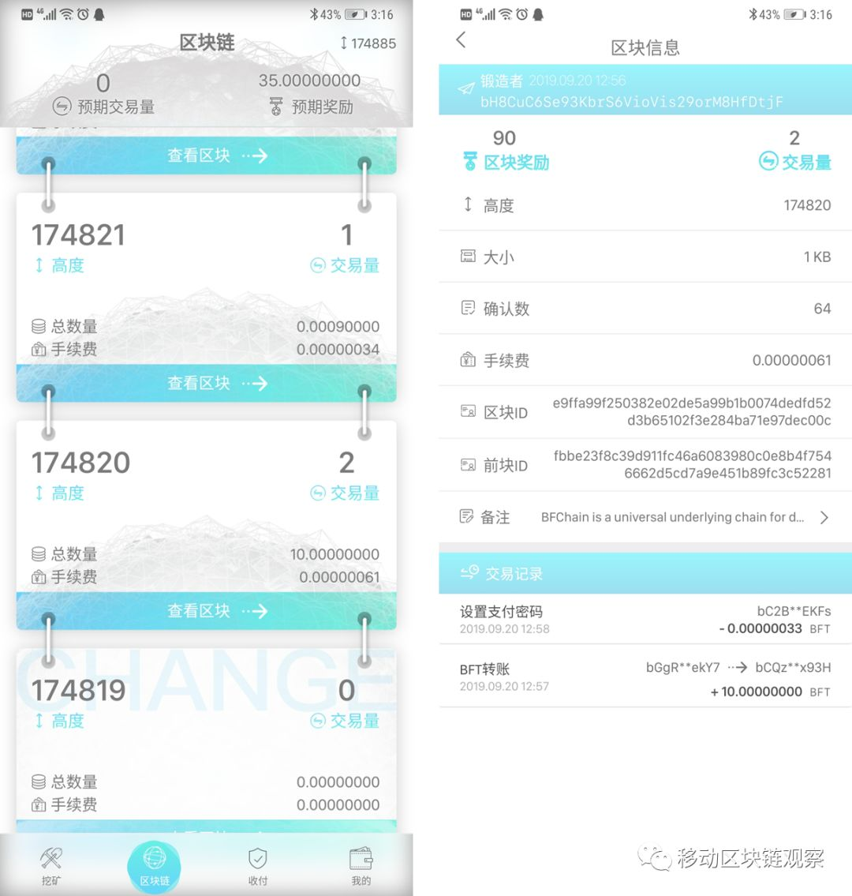
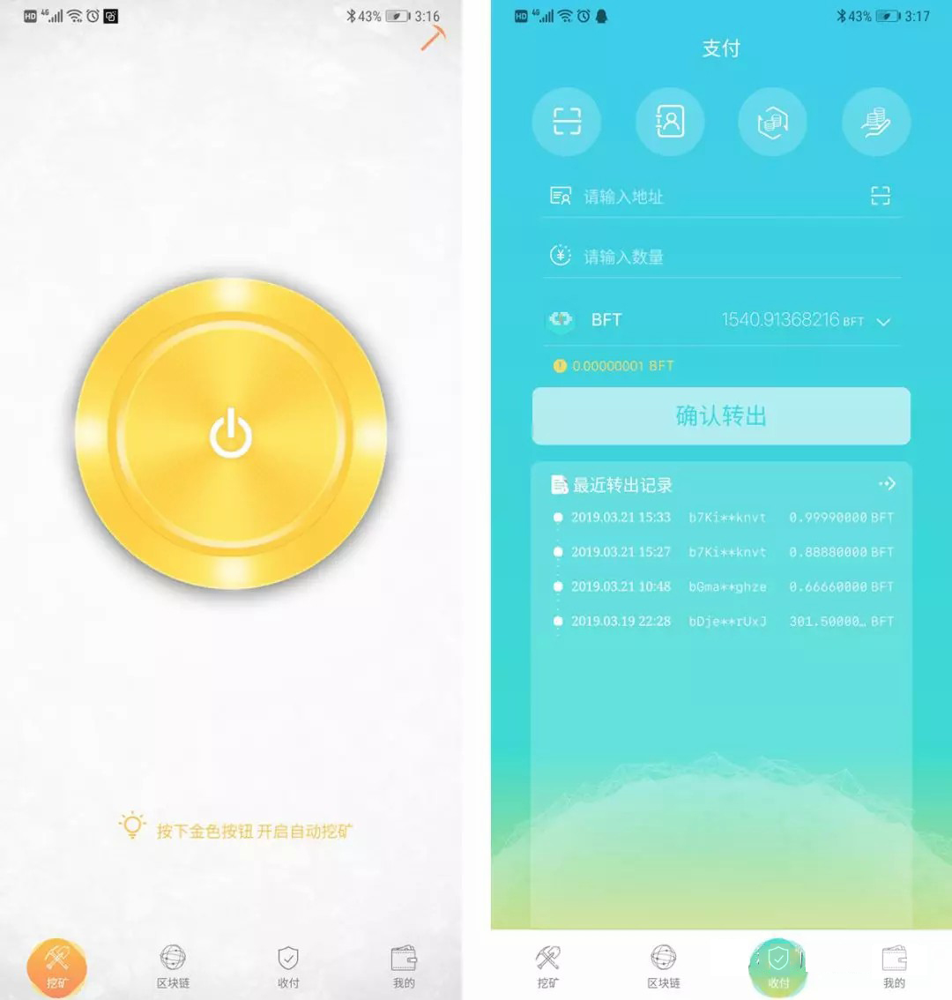

# 这么多年，为什么99.9%人还没见过区块链是什么样子？

比特币到现在已经十年了，而区块链作为比特币的底层技术被提出也有好几年的时间，发展到现在各种协议和技术不断出现。那么为什么到现在，99.9%的人都没见过区块链？区块链的应用落地场景也并未普及呢？  

一、**从根本原因来说**，底层技术的角逐还未尘埃落定。

区块链主要分为公有链、联盟链、私有链等。其中公有链是各个项目方主要争夺的战场，就像安卓、ios之于手机，windows之于电脑，没有底层的操作系统来支持，商用之路是不会有前途的。类似ETH、EOS、TRON等公链一直在争夺这个市场，但目前来看市场还未达到DAPP爆发的条件。去中心化、高并发、安全性等一直是亟待解决的问题。

无法将DAPP顺利的装进广大用户的手机里，怎么可能让大众感知到区块链的应用落地场景？

**二、从普通用户角度来说，区块链目前的使用门槛有些过高。**

1、用户学习成本过高。

区块链里面各种技术概念太多了，别提POW＼POS＼DPOS共识，什么拜占庭容错、ETH2.0，什么CPU＼RAM\NET等等，就连最简单的区块链账本，对于普通大众来说都比较难以理解，尤其是这些东西普通大众看不见也摸不着。只有降低学习成本，没有技术壁垒才能更好的教育用户。

2、使用成本过高。

这里说的使用成本主要是指账户注册，一些项目是需要花钱才能注册账户的。比如EOS。

圈外人很难想像，我注册个账户都要钱？

3、私钥的管理较复杂。  

我们都知道比特币等一些加密货币的私钥是和公钥一一对应的，而大部分产品的私钥是自定义生成的，由一串不规则的数字和字母组成的。这些私钥非常难以记忆，如果保管不当，又容易丢失。私钥丢了，加密资产就没了，很多人一听这么复杂也就不敢进入了，一个私钥的管理就让许多圈外人理解不了了，还谈什么落地。

所以，要想让区块链更加贴近普通大众，必须要跳出圈，降低使用门槛。

换句话说，区块链产品必须提升用户的使用体验。

综合以上两大原因，我们会发现，现有的区块链与用户之间缺乏一个重要的连接设备：

**手机！更长远更广泛的来说，就是移动设备。**

大家想一想，在移动互联网和智能手机普及之前，有多少老百姓会使用电脑？当时的PC端互联网让多少生活场景应用落地了？  

而现在，农村的老头老太太都会使用微信和快手，普通大众与互联网之间已经完全没有了壁垒。

这一切都在于智能手机作为一个重要的桥梁，让互联网随时随地，无处不在，从而实现了几乎360度的生活场景落地。  

然而现在的区块链市场，绝大部分公有链仍是PC端公有链，移动端无法直连链上，DAPP仍需要借助第三方中转。也就是说老百姓无法通过人手一部的手机，直接连接区块链，他们通过DAPP连接上的只是区块链网络中的某一个节点。

不论是什么产品，最终使用的都是普通用户，如果连普通用户都不能普及的话，在高大上的技术也只是小圈子里的小众产品。

**要想让普罗大众能够无门槛地看见区块链、参与区块链和使用区块链，这个壁垒必须打破！**

**全球首款移动端直连区块链的公有链——BFChain生物链林**，**做到了让大众通过手机即可无门槛的看得见区块链、使用区块链、直接参与区块链治理。**

该项目不仅开创了移动区块链的先河，更让区块链分布式可信网络应用可以直接安装到移动端设备使用，为区块链应用的落地和普及提供了无限的前景。

区块链在终端用户市场落地存在极大难度的技术门槛，一些对移动端依赖较强的行业应用落地难度也由此增加。BFChain生物链林的出现解决了这一痛点。通过在手机上安装BFChain生物链林节点软件，用户可以直连区块链并参与链上共识与链上治理。相比大部分经典区块链参与成本高、技术门槛高、浪费大量电力资源等等的问题，BFChain生物链林有着天然的技术优势、性能优势以及用户优势。

以BFChain生物链林的节点软件BFT为例，用户通过手机安装后，即可看得见BFChain的区块链，也可以直接参与链上治理，还可以实现点对点支付等功能。

不仅如此，BFT还提供自定义私钥功能。在算法生成密码的基础上，BFChain创新地使用了密语密码技术，用户可以将自己喜欢的一首诗、一首歌等作为私钥主密码使用，这样既解决了算法生成原始私钥难以记忆的问题，又增加了密码破解的难度。对于大众用户来说，BFT节点软件大大提升了区块链产品的使用体验。

无数的技术创新与突破让BFChain生物链林有着令人惊艳的系统性能表现，也代表着中国公链技术领先全球。BFChain实现了10000+TPS和秒级确认速度。2小时交易用户容量可达5000万+，浏览使用用户1亿亿以上，这意味着，BFChain可以基本满足当前网民的日常使用需求，正式上线后更有望成为下一代分布式可信网络的基础设施。

▲ BFChain与Bitcoin、Ethereum性能对比  

由于BFChain生物链林上可以搭载各种APP，使各种应用落地到用户的手机上，在不久的将来，BFChain将有可能实现在基础设施之上构建起全球范围的信用时代生活场景。届时，普罗大众将无障碍感知区块链，使用区块链。
