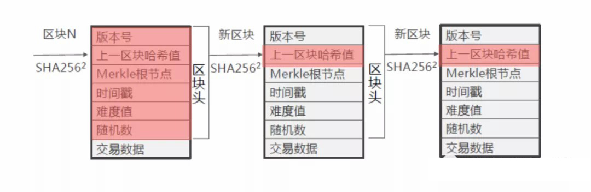

# 这两个特性是区块链作为价值互联网的基石

区块链具有数据不可篡改、可追溯的特性。这个特性使得区块链就像历史一样，发生了就是发生了，无法追悔，野史也无法代替正史写入人类的共识。区块链让数据归属权得到了确权，使得价值可以在互联网中传递。是什么让区块链拥有了这两大杀器呢？首先需要了解区块链的本质。

### 一、区块链的本质：分布式数据库

区块链的本质是一个分布式数据库，在区块链网络中的每一个节点都拥有最新的完整数据库拷贝，而这个数据库的运转和更新通过共识机制由所有节点共同维护。

即，区块链从数据存储上来说是分布式的，从数据更新上说需要通过所有节点的共识。

**举个例子**，有个村子原来由村会计记账，村长保管账本，但会计和村长可能为了个人私利偷偷做假账，村民们无可奈何。如今改为公共账本，全村人手一份，并且采用了一套公平规则选拔出记账人轮流记账，每个记账人负责记一页账目。村里规定得到记账权的人记录一页账本就会得到奖励，以保证全村人记账的积极性，但也同时规定如果这个公共账目失一旦效，所有奖励也无效。

记账过程是这样的：村子中发生的每一笔账目，都要广播给全村的人知道。记账人把这一段时间发生的账目记入账本中，再发给全村人核对这页账本，若这页账本中的交易记录有假，无法通过全村的共识确认，那么这页假账本就会被作废。若51%以上的村民确认这页账本有效，按照少数服从多数的原则全村达成共识，这一页就被正式计入公共账本中。同时全村人都把这一页新账本添加到自己保管的那份账本中去。一个或若干个村民手中的账本信息与其他人不一样，公共账本以多数村民手中一致的那份账本为准。

正是这种分布式的记账技术，杜绝了单个甚至多个节点篡改数据，因为他们对数据库的修改无法影响其他节点的数据库，除非能控制整个网络中超过51%的节点同时修改。但是在现实世界中控制51%的节点需要付出难以估算的成本，就算控制了，原先的公共账本相当于失效了，基于原先的公共账本发放的奖励都无效了，那攻击这个公共账本的意义又有何在呢？所以可以认为这个情况基本不会发生。

从全网层面来说，区块链通过分布式记账技术和共识机制保证了数据的不可篡改。

从具体层面来说，为什么所有的节点能够核对区块链网络中数据的真伪呢？

这其中牵涉到两个关键的部分，一个是区块链的数据结构，另外一个是密码学算法的保证，牵涉到哈希算法与非对称加密算法两项核心技术。

### 二、区块链数据结构：块链式结构

为什么区块链叫区块链（Block Chain）? 是因为区块链是由区块（Block）+链（Chain）组成的。

**区块，即数据块**，可以理解为公共账本中的一页，上面记录了交易数据。

**那什么是链呢？**

让我们先来看看区块的组成结构：区块头+区块体。

区块头中记录：上一个区块的哈希值（针对上一个区块头计算得来）、默克尔根（可以简单理解为本区块具体交易数据的哈希值）、时间戳（记录该区块产生的时间）等摘要信息。

区块体中记录：这一段时间内产生的具体交易数据

**在每个区块头中记录了上一个区块的哈希值，计算当前区块的哈希值时，同时包含了上一个区块的哈希值。正是区块结构+哈希值+时间戳这样一套体系让每个相邻区块环环相扣，从而形成了链。** 所以区块链中的每一条信息或交易记录都可以溯源，可查询其来龙去脉。而关键因素——哈希值确保了区块数据的不可篡改，因为“牵一发而动全身”。下面就来解释一下这个关键因素是如何发挥作用的。

### 三、哈希算法

哈希（Hash）算法是一种单向加密算法。

散列函数（英语：Hash function）又称散列算法、哈希函数，是一种从任何一种数据中创建小的数字“指纹”的方法。散列函数把消息或数据压缩成摘要，使得数据量变小，将数据的格式固定下来。该函数将数据打乱混合，重新创建一个叫做散列值（hash values，hash codes，hash sums，或hashes）的指纹。散列值通常用一个短的随机字母和数字组成的字符串来代表。[1]

这个散列值也就是哈希值。

用一句话来说，哈希函数就是一种将任意长度的消息压缩为一个长度较短且长度固定的消息摘要的公开函数。

在密码学里，哈希函数就是用来防篡改的。它是一种单向函数，只有加密过程，没有解密过程。

它的函数表达式为：y=H（x）。简单的从数学层面来理解哈希函数的特性：

- x1,x2不同，则H(x1) ≠ H(x2),即y1≠y2

- 由x通过哈希函数计算出y很容易，由H(y)计算出x是不可行的

- x的变化会引起其哈希值y的变化，且变化不可预测

哈希函数的主要作用于校验信息的完整性。

**用通俗的比喻理解**：每一篇不同的博士论文通过哈希函数运算会得出不同的哈希值，得出的哈希值对每一篇博士论文都具有对应的标识能力，但无法通过这个哈希值还原出这篇博士论文。论文中哪怕一个标点符号发生了改变，计算出来的哈希值也将发生改变。如果在上传每篇博士论文的同时附带了这篇论文的哈希值，我们在下载了这篇博士论文及其哈希值后，再对论文运算一遍哈希值，对比一下两个哈希值是否一致，就知道这篇博士论文在数据传递的过程中是否被篡改过了或者下载的内容是否完整。

之前我们提到了，在每一个区块头中都含有上一个区块的哈希值以及本区块实际数据的哈希值，而这个区块头的哈希值又会被下一个区块头记录进去。由此我们可以得出以下推论：

1. 每个区块的哈希值是唯一的，哈希值可用作每个区块的标识（数据指纹）。

2. 一旦区块中发生数据变化，哪怕是一个微小的变化，其得出的哈希值也会发生变化。哈希值可以用来校验区块中的数据是否被篡改。

哈希值让区块之间按严格的顺序关系形成了链条结构。如果某个区块中的一条交易记录被篡改了，那么这个区块的哈希值也会变化，后续所有区块的哈希值都会变动，这就是“牵一发而动全身”。那么节点会很容易发现区块数据被篡改了，“伪”区块无法通过全网的共识，就没有办法上链。

### 四、非对称加密算法

也许有人会问，如果一条交易数据在未被写入区块之前，在数据传递的过程中就被篡改了，怎么办？节点如何去验证最新区块中所有交易数据的真实性呢？

区块链采用了非对称加密算法配合哈希算法，从源头保证了区块数据不可篡改。

什么是非对称加密？

非对称加密通过算法生成一对不同的密钥，一把用来加密，另一把用来解密，反之亦然。其中一把是公钥，一把是私钥。公钥可以发给任何请求它的人，私钥只能由持有方保管，不能外泄。通过公钥等信息无法推导出私钥。

通过这种密码机制，只要一对密钥，就可以将公钥分发给多个账户，一对多进行加密传输。

**非对称加密有两个作用：**

1. 加密作用：防止数据在传递中被泄露、篡改（公钥加密，私钥解密）

2. 数字签名：验证数据发送方的身份是否属实（私钥加密，公钥解密）

实现过程如下：

**首先需要生成自己的私钥和公钥：** 信息发送方A，生成私钥A和公钥A；信息接收方B，生成私钥B和公钥B。

**如果用途是加密传输**：A用B给的公钥B对明文加密，B收到密文后，用私钥B进行解密，得到还原的明文。

**举个例子**，小明过生日，朋友们打算给小明分别快递礼物，为了防止快递过程有人偷窥或换掉礼物，需要将快递盒上密码锁。小明把同样的公钥分别派发给朋友小亮、大雄、咚咚，他们仨人装好自己准备的礼物后，用小明给的公钥给快递盒加密上锁。小明收到三份礼物后，用自己的那把私钥就可以解锁这三份不同的礼物了。

**如果用途是数字签名**：A将需要传递的信息通过私钥A实行数字签名，B收到加密信息后，用A给的公钥A用验证出A的数据签名无误，确为A发出的。

在区块链中，为了防止发送节点的信息被篡改或伪造，需要在哈希算法的基础上引入非对称加密算法的**数字签名方案**。

1. 发送节点对信息Y进行哈希运算，得到对应的哈希值X。然后用私钥对X进行数字签名，得到签名N。

2. 发送节点将信息Y和数字签名N发送给接收节点，并且广播给所有节点。

3. 接收节点使用发送节点的公钥对数字签名N进行解密，如果签名N没有被伪造，则可以解出X。

4. 接收节点使用哈希算法对接收到的信息再运算一次得到哈希值Z，如果Z=X，则可验证信息Y在传递过程中没有被篡改。

5. 所有的节点可以同步验证此信息的真伪，因为解密数字签名的公钥是公开的。

**举个例子**：小张发送一张借条给到小刘，他先对借条内容进行哈算运算，得到一个哈希值x1，再使用自己的私钥对这个哈希值实行加密得到一个数字签名。小刘收到支票后，用小张给的公钥对数字签名解密，如果能解出来，就说明这确实是小张签发的。小刘再对借条内容进行哈希运算，得到哈希值x2，将x2与用公钥解密出来的哈希值x1对照，如果两个哈希值一样，就说明借条在传递过程中没有被篡改。

由此可见，区块链网络中的信息传递过程也是防篡改的,用密码学手段来验证数据的来源真实与内容完整性，而数字签名让数据的生产/发送方确保了对数据的对应与所有权。

说到这里，不仅解释了区块链为什么具有数据不可篡改性，也同时解释了为什么区块链可以让数据确权。在信息互联网中，数据易删，易复制，易篡改，而且没有天然的权属机制和标签，李逵和李鬼的现象比比皆是，使得数据无法确权。但现有的网络安全技术又无法保障高价值数据的流转，需要依靠银行等第三方信用机构背书。在价值传递的过程中，互联网起到的只是记录信息更改的作用，而非价值流转的作用。而区块链通过不可篡改性和数字签名方案确保了数据的真实性和数字对象的唯一性，区块链上的数字对象无法复制。在区块链中，每个区块链对象一定绑定了自己的所有者账户，即地址。这样在区块链网络中就无需通过第三方直接实现价值传递了。  

**总结一下：区块链打造了一种不同以往的数据库技术，数据一旦被通过全网共识写入了区块，那么就形成了既定事实，就像历史一样，可以往前回溯，往后衔接，但是却无法再更改。换句话说，区块链中的数据没有修改与删除功能，只能一次性写入，剩下能做的就是更新了。加上数字签名方案，使得数据得以确权，价值得以在网络中传递。**
